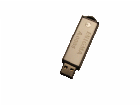
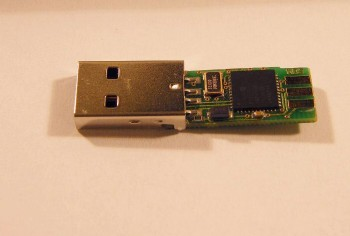

# go-enk
### EnigmaKey Encyption Device Control Examples ###

##### The Enigmakey is an encryption engine loaded on to an mpic chip and is totally portable. Whats more once removed there is no footprint left on the master. #####

